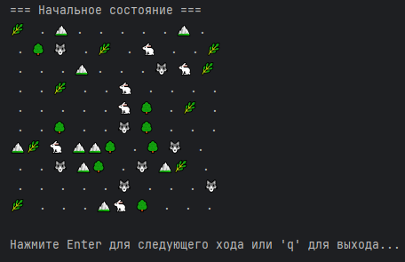

# Simulation
## Цель проекта
- Отработать ООП

## О проекте
Проект из RoadMap'а Сергея Жукова

Проект представляет собой симуляцию жизни, в которой есть следующие сущности:
- Камни и деревья — препятствия для передвигающихся объектов;
- Трава — пища для травоядных;
- Травоядные — передвигающееся существо, имеющее здоровье. Цель данного существа — найти траву, чтобы съесть её;
- Хищники — передвигающееся существо, которое также имеет здоровье. Цель хищника — найти травоядного и «откусить» от него кусок;

## Правила
Создаётся карта, на которой располагаются все сущности.
Симуляция обновляется по нажатию Enter, останавливается при нажатии q.
На экран выводится следующая информация:
- Номер итерации симуляции;
- Карта симуляции

## Процесс работы симуляции:
- Старт симуляции:
    - Инициализация карты с помощью генерации заданного количества сущностей в случайных местах;
    - Запуск главного цикла симуляции.
- Каждая итерация симуляции:
    - Обновление номера итерации;
    - травоядные и хищники делают ход;
    - Травоядные и хищники ищут самый короткий путь до ближайшей цели с помощью алгоритма BFS;
